# Developer Guide

## Acknowledgements
SE-EDU Addressbook 3 Developer Guide: https://se-education.org/addressbook-level3/DeveloperGuide.html

## Design & implementation

### Design: Kai Jie

Below is a diagram showing the high level design of Dextro.

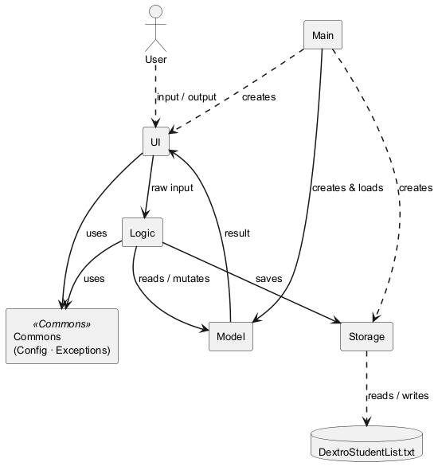

**Arrow notation:**
- **Solid arrows (`-->`)** represent structural dependencies (one component uses or depends on another).
- **Dashed arrows (`..>`)** represent instantiation or creation (one component creates instances of another).

Given below is a quick overview of the main components and how they interact with each other.

**Main components of the architecture**

`Main` is the entry point of the application. It is responsible for initialising all components in the correct sequence and connecting them to each other at launch. At shutdown, it terminates the application by exiting the `App` run loop.

The bulk of the app's work is done by the following five components:

- `UI` : Handles all console input and output.
- `App` : Orchestrates the main run loop, coordinating all other components.
- `Logic` : Contains the `Parser`, and the `Commands` packages. Parser interprets raw user input into executable `Command` objects.
- `Model` : Holds the student data in memory (`StudentDatabase`, `Student`, `Module`, `Grade`).
- `Storage` : Reads data from, and writes data to, the hard disk.
- `Config` holds application-wide constants (command keywords) used across components.

**How the architecture components interact with each other**

The sequence diagram below shows how the components interact with each other for the scenario where the user issues the command `delete 1`.

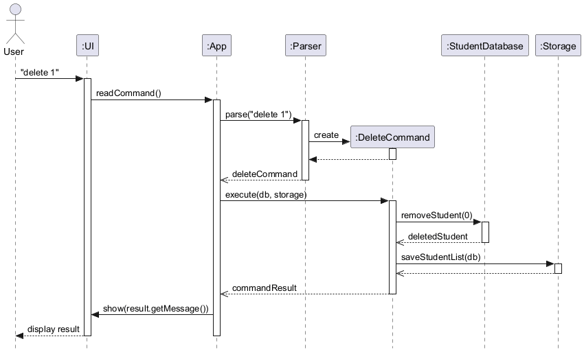
 
---

#### UI Component

The `Ui` class handles all console input and output. It reads user commands from standard input via a `Scanner` and displays messages surrounded by separator lines.

The `UI` component:
- is instantiated once by `Main` and passed into `App`.
- exposes `readCommand()` (instance method) which `App` calls each loop iteration to obtain the next line of input using the instance's `Scanner`.
- exposes the static methods `Ui.show(String)` and `Ui.line()` to allow display of command results and error messages from anywhere in the application without requiring a `Ui` reference.
- separates concerns: input reading requires state (Scanner) and uses instance methods; output display is stateless and uses static methods for convenience.

---

#### App Component

The `App` component is responsible for continuously running the program until a flag to stop is received from a `CommandResult`. It coordinates all major components — `Parser`, `Ui`, `StudentDatabase`, `Storage`, and `CommandHistory` — within its main loop.

The `App` component:
- depends on `Parser` to parse user input into `Command` objects.
- calls `Command.execute(db, storage)` and receives a `CommandResult`.
- uses `Ui` to read input and display output.
- uses `CommandHistory` to track undoable commands, pushing each onto the stack after successful execution.
- terminates the loop when `CommandResult.shouldExit()` returns `true`.
- catches `ParseException` and `CommandException` in its main loop and displays the error message via `Ui.show()`.

---

#### Parser Component

The `Parser` component is responsible for interpreting raw user input into executable `Command` objects. It splits input into a command keyword and arguments, delegates argument tokenisation to `ArgumentTokenizer`, delegates validation to `Validator` and normalisation to `Normalizer`, and constructs the appropriate `Command`.

`Parser`:
- uses `ArgumentTokenizer` to tokenise argument strings into key-value maps for commands that take named fields (e.g. `n/`, `p/`, `e/`).
- uses `Validator` and `Normalizer` to ensure fields used by commands will not cause unexpected behaviour.
- uses constants from `Config` in a switch expression to route the command keyword to the correct private `parseX()` method.
- holds a reference to `CommandHistory` (injected by `App`) which it passes into `UndoCommand`.
- throws `ParseException` when the input is malformed or a field fails validation.

`ArgumentTokenizer` scans a raw argument string for recognised prefixes and extracts the substring between each prefix and the next as its value. It throws `ParseException` if a duplicate prefix is detected.
 
---

#### Model Component

The Model component holds all student data in memory.

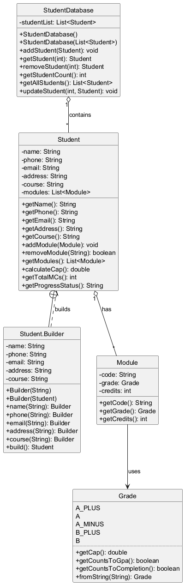

The `Model` component:
- uses `StudentDatabase` to hold the in-memory `List<Student>` and expose CRUD operations (`addStudent`, `removeStudent`, `getStudent`, `getAllStudents`).
- represents each student as a `Student` object, constructed via the inner `Student.Builder` class which enforces that `name` is always provided. Each `Student` holds personal fields (`name`, `phone`, `email`, `address`, `course`) and a `List<Module>`.
- represents each enrolled module as a `Module` object carrying a module code, a `Grade`, and a credit count (defaulting to 4 MCs).
- uses the `Grade` enum to represent all possible grade values, where each constant carries a grade-point value and flags for GPA and completion counting, used by `Student.calculateCap()` and `Student.getTotalMCs()`.

The `Model` component does not depend on `Storage` or `Parser` — it represents pure data and business logic.
 
---

#### Storage Component

The `Storage` component handles reading from and writing to the flat-file database at `./data/DextroStudentList.txt`.

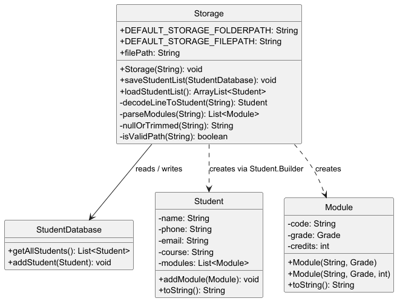

The `Storage` component:
- saves the full `StudentDatabase` to disk after every mutating command, serialising each `Student` and its `Module` list as a delimited string.
- loads the student list at startup, parsing each line back into `Student` and `Module` objects. If the file or directory does not exist, it creates them and returns an empty list.
- throws `StorageException` on file I/O errors, which `Main` catches and handles by starting with an empty `StudentDatabase`.

---

#### Common Classes

The following classes are used across multiple components.

##### Command

`Command` is an interface implemented by all command classes. It defines the contract for execution, undoing, and reporting undo eligibility.

The fourteen concrete implementations are:

| Class                | Undoable |
|----------------------|----------|
| `CreateCommand`      | yes      |
| `ForceCreateCommand` | yes      |
| `DeleteCommand`      | yes      |
| `EditCommand`        | yes      |
| `AddCommand`         | yes      |
| `RemoveCommand`      | yes      |
| `SortCommand`        | yes      |
| `ListCommand`        | no       |
| `FindCommand`        | no       |
| `SearchCommand`      | no       |
| `StatusCommand`      | no       |
| `HelpCommand`        | no       |
| `ExitCommand`        | no       |
| `UndoCommand`        | no       |

`AddCommand` and `RemoveCommand` reside in the `dextro.command.module` sub-package; all others are in `dextro.command`.

---

##### CommandResult

`CommandResult` encapsulates the outcome of a command execution. It is created by every `Command` implementation and read by `App` after each `execute` call.

`CommandResult`:
- carries a `message` string displayed to the user via `Ui.show()`.
- carries an `exit` flag; when `shouldExit()` returns `true`, `App` breaks its run loop.
- optionally carries a `pendingCommand` (multiplicity `0..1`) for the duplicate-student confirmation flow, where `CreateCommand` returns a `CommandResult` wrapping a `ForceCreateCommand` that `App` executes on user confirmation.

---

##### Exceptions

`CommandException` and `ParseException` are both unchecked exceptions (extending `RuntimeException`) thrown by their respective subsystems and caught centrally by `App`.

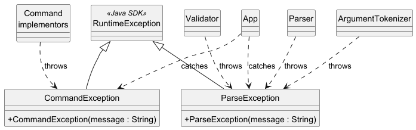

- `CommandException` is thrown by all fourteen `Command` implementations when execution cannot proceed (e.g. an out-of-bounds index or an invalid operation).
- `ParseException` is thrown by `Parser`, `ArgumentTokenizer`, and `Validator` when input is malformed or a field fails validation.
- `App` catches both in its main loop and displays the error message via `Ui.show()`.

---

##### Config

`Config` is a `final` utility class with a private constructor, containing only `public static final String` constants for every command keyword.

`Parser` is the sole consumer of `Config`, using its constants in a switch expression to route command keywords to the correct `parseX()` method. Centralising the keywords in `Config` means a keyword change requires editing exactly one class.

---

### Implementation: Kai Jie

#### CreateCommand

`CreateCommand` handles the creation of a new student record. It checks for duplicate fields before committing, and supports undo by recording the index of the student it created.

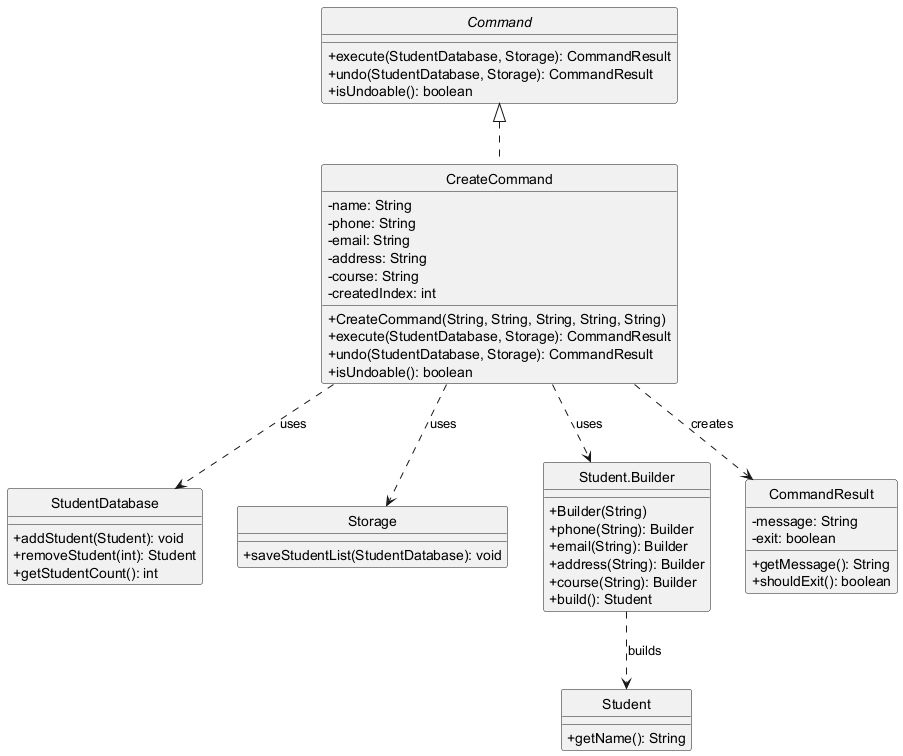

The sequence diagram below shows the flow for `create n/Alice p/91234567 e/alice@u.nus.edu c/CS`, where no duplicate fields are found.

When `execute(db, storage)` is called:
- It first calls `db.findDuplicateFields(...)` to check for conflicts with existing students.
- If conflicts exist, it returns a `CommandResult` wrapping a `ForceCreateCommand` as its `pendingCommand`, with `requiresConfirmation()` set to `true`. `App` then prompts the user for confirmation and executes the `ForceCreateCommand` if confirmed (see `ForceCreateCommand` below).
- If no conflicts exist, it delegates to the package-private `doCreate(db, storage)`.

`doCreate(db, storage)`:
- Constructs a new `Student` using `Student.Builder`, setting all five fields.
- Calls `db.addStudent(student)` and `storage.saveStudentList(db)` to persist the change.
- Records `createdIndex` for use by `undo`.

When `undo(db, storage)` is called:
- Throws `CommandException` if `createdIndex == -1` (command was never executed).
- Throws `CommandException` if `createdIndex >= db.getStudentCount()` (student no longer exists at that index).
- Otherwise calls `db.removeStudent(createdIndex)` to reverse the creation.

---

#### ForceCreateCommand

`ForceCreateCommand` is a thin wrapper around `CreateCommand` that bypasses the duplicate check. It is never constructed by `Parser` — it is created exclusively by `CreateCommand.execute` when a conflict is detected, and returned to `App` inside a `CommandResult`.

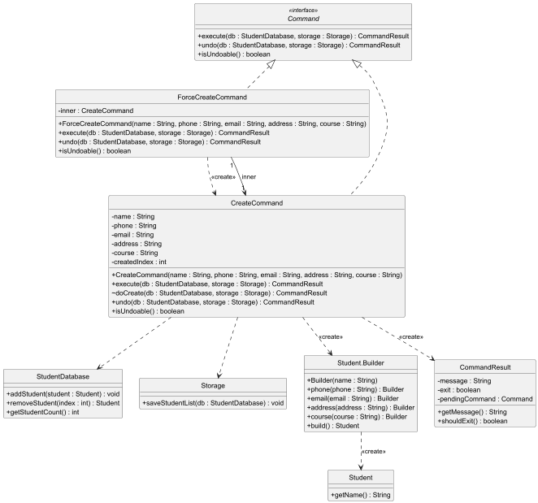

The sequence diagram below shows the flow after `App` receives a `CommandResult` with `requiresConfirmation() == true` from `CreateCommand`.

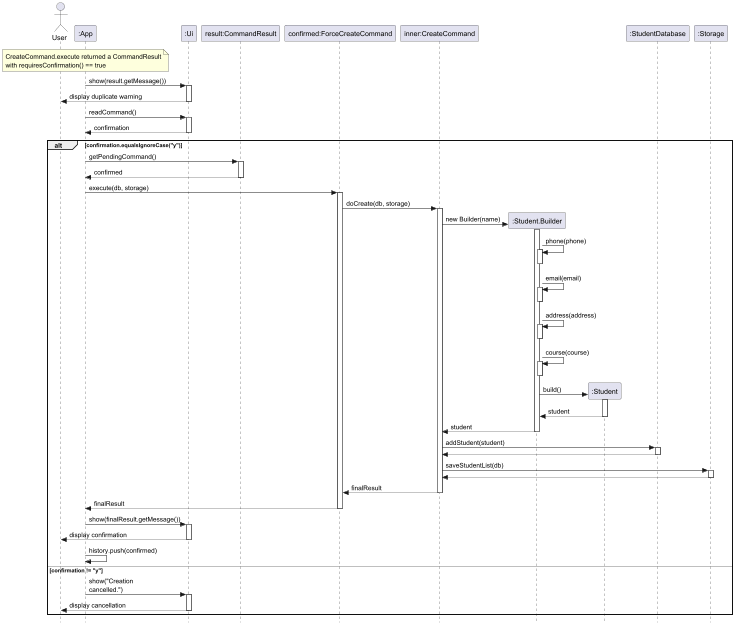

When the user confirms with `y`:
- `App` retrieves the `ForceCreateCommand` via `result.getPendingCommand()`.
- `App` calls `confirmed.execute(db, storage)`, which delegates directly to `inner.doCreate(db, storage)`, skipping `findDuplicateFields`.
- `App` pushes the `ForceCreateCommand` (not the original `CreateCommand`) onto `CommandHistory`.

When the user does not confirm:
- `App` displays `"Creation cancelled."` and nothing is pushed to `CommandHistory`.

When `undo(db, storage)` is called on a `ForceCreateCommand`:
- It delegates to `inner.undo(db, storage)`, which removes the student at `createdIndex` from `StudentDatabase`.
---

#### Delete Command

The `DeleteCommand` allows users to remove an existing student record by 1-based index. It supports undo by storing the deleted `Student` and its original index for reinsertion.

##### Class Diagram

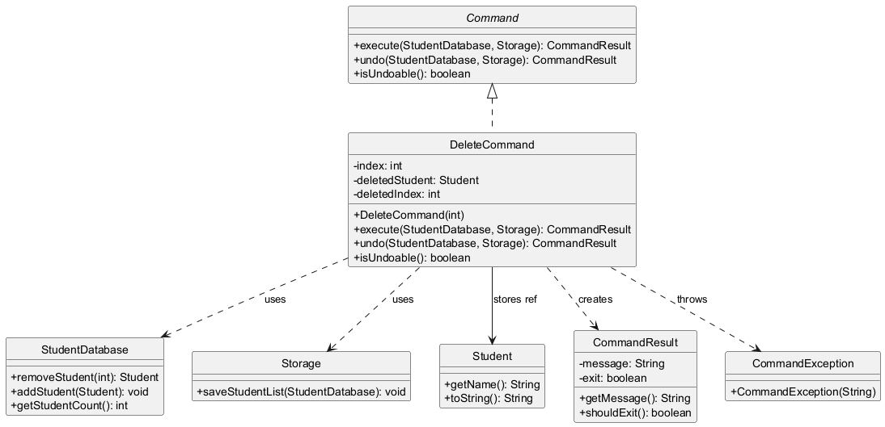

The class diagram shows the relationship between `DeleteCommand` and other components:
- `DeleteCommand` implements the `Command` interface.
- It calls `StudentDatabase.removeStudent(index)` and stores the returned `Student` for potential undo.
- It calls `Storage.saveStudentList()` to persist the change.
- It throws `CommandException` if the index is out of bounds.
- It returns a `CommandResult` containing the deleted student's details.

##### Sequence Diagram

The sequence diagram illustrates the execution flow:
1. User inputs the delete command (e.g., `delete 1`).
2. `Parser.parse()` identifies the `delete` keyword and calls `Parser.parseDelete()`, which parses the integer index.
3. A `DeleteCommand` is constructed with the index.
4. `App` calls `DeleteCommand.execute(db, storage)`.
5. If the index is out of bounds, `CommandException` is thrown and `App` displays the error.
6. Otherwise, `db.removeStudent(index - 1)` is called, the returned `Student` is stored, `storage.saveStudentList(db)` is called, and a `CommandResult` with the student's details is returned.

---

#### List Command

The `ListCommand` retrieves and displays all student records currently held in `StudentDatabase`. It is not undoable as it performs no mutations.

##### Class Diagram

The class diagram shows the relationship between `ListCommand` and other components:
- `ListCommand` implements the `Command` interface.
- It calls `StudentDatabase.getAllStudents()` to retrieve the full student list.
- It formats each student using `Student.toString()` with a 1-based index prefix.
- It returns a `CommandResult` with the formatted list, or a `"No students found."` message if the list is empty.
- `isUndoable()` returns `false`; `undo()` throws `CommandException`.

##### Sequence Diagram

The sequence diagram illustrates the execution flow:
1. User inputs `list`.
2. `Parser.parse()` matches the `list` keyword and returns `new ListCommand()` directly (no argument parsing required).
3. `App` calls `ListCommand.execute(db, storage)`.
4. `ListCommand` calls `db.getAllStudents()` and checks if the list is empty.
5. If empty, a `CommandResult("No students found.")` is returned.
6. Otherwise, `ListCommand` iterates over all students, calls `student.toString()`, and builds a numbered output string.
7. A `CommandResult` containing the formatted list is returned and displayed via `Ui`.

---

#### Add Command

The `AddCommand` adds a `Module` to an existing student's module list, identified by 1-based index. The module is specified as `CODE/GRADE` or `CODE/GRADE/CREDITS`. It supports undo by removing the added module.

##### Class Diagram

The class diagram shows the relationship between `AddCommand` and other components:
- `AddCommand` implements the `Command` interface, residing in the `dextro.command.module` subpackage.
- It retrieves the target `Student` from `StudentDatabase` by index.
- It constructs a `Module` with the given code, `Grade`, and optional credit count.
- It calls `student.addModule(module)` and `storage.saveStudentList(db)`.
- `undo()` calls `student.removeModule(moduleCode)` to reverse the addition.

##### Sequence Diagram

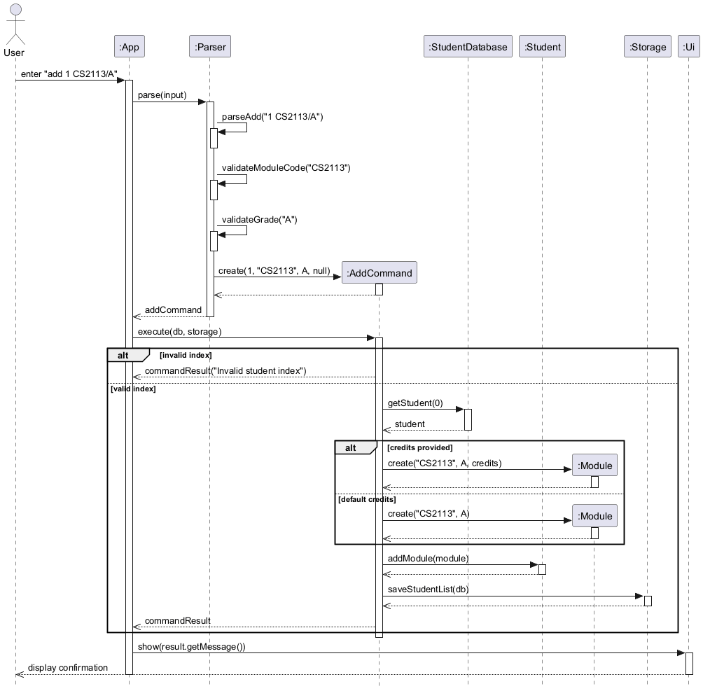

The sequence diagram illustrates the execution flow:
1. User inputs the add command (e.g., `add 1 CS2113/A`).
2. `Parser.parse()` identifies the `add` keyword and calls `Parser.parseAdd()`.
3. `Parser.parseAdd()` splits the index from the module string, validates the module code via `validateModuleCode()` and the grade via `validateGrade()` (which calls `Grade.fromString()`).
4. An `AddCommand` is constructed with the index, module code, `Grade`, and optional credits.
5. `App` calls `AddCommand.execute(db, storage)`.
6. If the index is invalid, a `CommandResult("Invalid student index")` is returned immediately.
7. Otherwise, the student is retrieved, a `Module` is constructed, `student.addModule(module)` is called, `storage.saveStudentList(db)` is called, and a `CommandResult` confirming the addition is returned.

---

#### Remove Command

The `RemoveCommand` removes a named `Module` from an existing student's module list, identified by 1-based index. It supports undo by storing the removed `Module` reference for reinsertion.

##### Class Diagram

The class diagram shows the relationship between `RemoveCommand` and other components:
- `RemoveCommand` implements the `Command` interface, residing in the `dextro.command.module` subpackage.
- It retrieves the target `Student` from `StudentDatabase` by index.
- It iterates over `student.getModules()` to locate and store a reference to the module before removal (for undo support).
- It calls `student.removeModule(moduleCode)` and `storage.saveStudentList(db)`.
- `undo()` calls `student.addModule(removedModule)` to reinsert the saved module.
- `CommandException` is thrown by `undo()` if the command was never executed or the module was not found.

##### Sequence Diagram

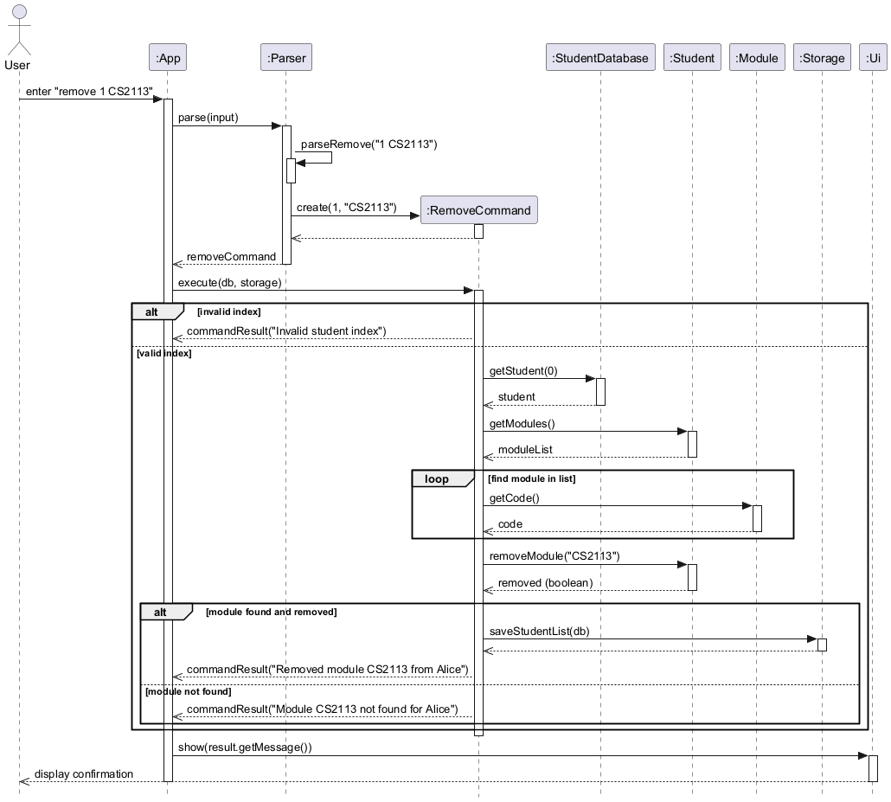

The sequence diagram illustrates the execution flow:
1. User inputs the remove command (e.g., `remove 1 CS2113`).
2. `Parser.parse()` identifies the `remove` keyword and calls `Parser.parseRemove()`, which splits the index and module code.
3. A `RemoveCommand` is constructed with the index and module code (uppercased).
4. `App` calls `RemoveCommand.execute(db, storage)`.
5. If the index is invalid, a `CommandResult("Invalid student index")` is returned immediately.
6. Otherwise, the student is retrieved and `student.getModules()` is iterated to find and store the matching `Module`.
7. `student.removeModule(moduleCode)` is called; if successful, `storage.saveStudentList(db)` is called and a confirmation `CommandResult` is returned.
8. If the module code is not found, a `CommandResult` indicating the module was not found is returned.

---

### Implementation: Matthias

#### Status Command

The `StatusCommand` allows users to view detailed information about a specific student, including their CAP, total MCs completed, and progress status.

##### Class Diagram

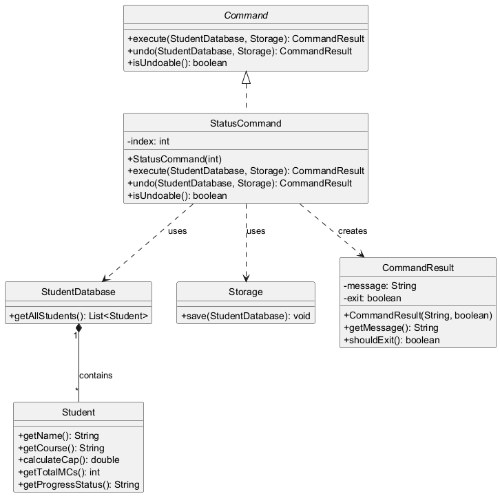

The class diagram shows the relationship between `StatusCommand` and other components:
- `StatusCommand` implements the `Command` interface
- It uses with `StudentDatabase` to retrieve student information, and Storage to save the changes.
- Returns a `CommandResult` containing the status information

##### Sequence Diagram

The sequence diagram illustrates the execution flow:
1. User executes the status command with a student index
2. `StatusCommand.execute()` is called with the `StudentDatabase` and `Storage`
3. The command validates the index and retrieves the student
4. Student information (CAP, MCs, status) is calculated and formatted
5. A `CommandResult` is returned with the formatted status message

#### Undo Command

The `UndoCommand` allows users to revert the last undoable command that modified the student database.

##### Class Diagram

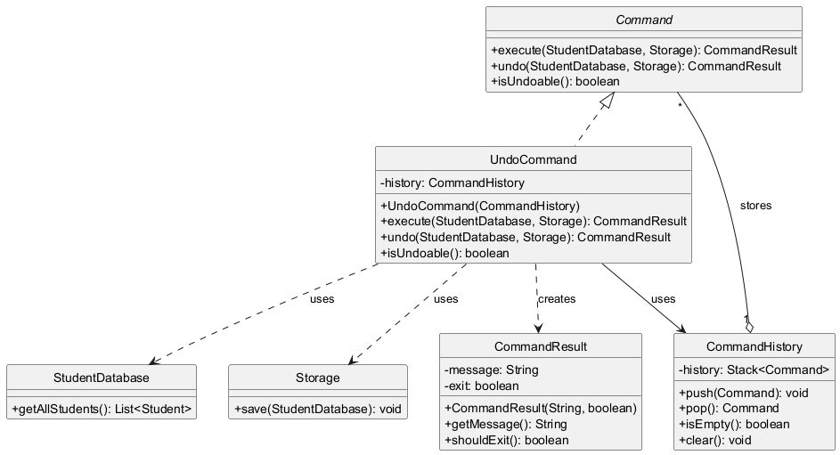

The class diagram shows the relationship between `UndoCommand` and other components:
- `UndoCommand` implements the `Command` interface
- It maintains a reference to `CommandHistory` which tracks executed commands
- It interacts with `StudentDatabase` and `Storage` to perform the undo operation
- Returns a `CommandResult` indicating the undo operation result

##### Sequence Diagram

The sequence diagram illustrates the execution flow:
1. User executes the undo command
2. `UndoCommand.execute()` is called with the `StudentDatabase` and `Storage`
3. The command checks if there are any commands to undo in the `CommandHistory`
4. If available, the last command is popped from the history
5. The `undo()` method of the last command is invoked
6. A `CommandResult` is returned indicating the success or failure of the undo operation

---

### Implementation: Wen Yuan

#### Edit Command

The `EditCommand` allows users to alter attributes of the student records.

##### Class Diagram

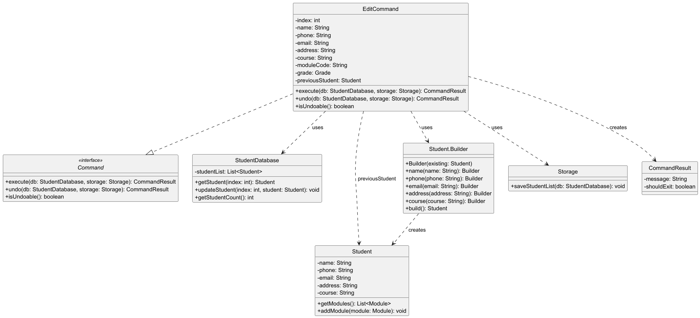

The class diagram shows the relationship between `EditCommand` and other components:
- `EditCommand` implements the `Command` interface
- `EditCommand` needs references from Storage and Student class, and has an aggregation relationship with StudentDatabase. 
- It interacts with `StudentDatabase` to retrieve/manipulate student information
- It uses the `Storage` component for persistence operations
- Returns a `CommandResult` containing the status information
- All methods listed in `Command` is implemented in `EditCommand` class as there is no further child class from `EditCommand`.

##### Sequence Diagram

The sequence diagram illustrates the execution flow:
1. User executes the edit command with attribute flags(e.g n/ for name and a/ for address)
2. `Parser` class parse user input and determine which exactly which record is of concern and which attribute needs to be edited based on the flags
3. `EditCommand` class constructs an object with all attributes attach to it.
4. The exact `Student` object is extracted out of `StudentDatabase`
5. The `Student` object is then rebuilt with updated attributes.
6. If module need to updated, `EditCommand` will search through the list of modules in `Student`. If Module does not exist, it will add the module in the `Student`.
7. `saveStudentList()` is called to save all updates in the database.

#### Find Command

The `FindCommand` allows users to find user-defined keyword and pinpoint to student record containing that keyword. More than one record can be queried if there is a common keyword.

##### Class Diagram

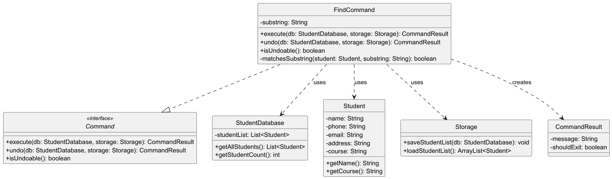

The class diagram shows the relationship between `FindCommand` and other components:
- Similar to `EditCommand`, `FindCommand` also implements the `Command` interface
- `FindCommand` needs to reference of `Storage` and `StudentDatabase`. 
- `FindCommand` compose of `CommandException`. 
- It interacts with `StudentDatabase` to retrieve relevant student records.
- Although `Storage` is not used in execute method under `FindCommand`, the `Command` require it to be there. So the method signature must match `Command`.
- All methods listed in `Command` is implemented in `FindCommand` class as there is no further child class from `FindCommand`.

##### Sequence Diagram

The sequence diagram illustrates the execution flow:
1. User executes the find command with string that he/she wants to find.
2. `Parser` class parse user input and determine the command(find) and the keyword(string).
3. `FindCommand` then retrieve all student information from `StudentDatabase` .
4. A loop will check if any of the student information correspond to the keyword defined by the user.
5. The `CommandResult` will display if the student records are found.

---

### Implementation: Agara

##### Sort Command

The `SortCommand` allows users to view a temporary list of all users sorted by certain categories selected by the user, such as name, course, and mcs.

##### Class Diagram

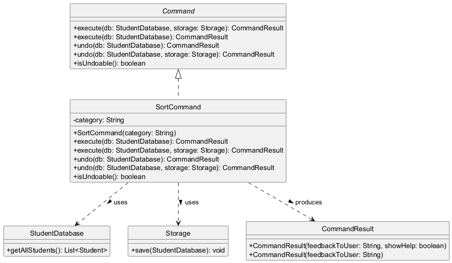

The class diagram shows the relationship between `SortCommand` and other components:
- `SortCommand` implements the `Command` interface
- `SortCommand` needs to reference of `Storage` and `StudentDatabase`. 
- It interacts with `StudentDatabase` to retrieve all student records and sort them based on the specified category.
- Although `Storage` is not used in execute method under `SortCommand`, the `Command` require it to be there. So the method signature must match `Command`.
- All methods listed in `Command` is implemented in `SortCommand` class as there is no further child class from `SortCommand`.
- Returns a `CommandResult` containing the sorted list of students based on the specified category.

##### Sequence Diagram

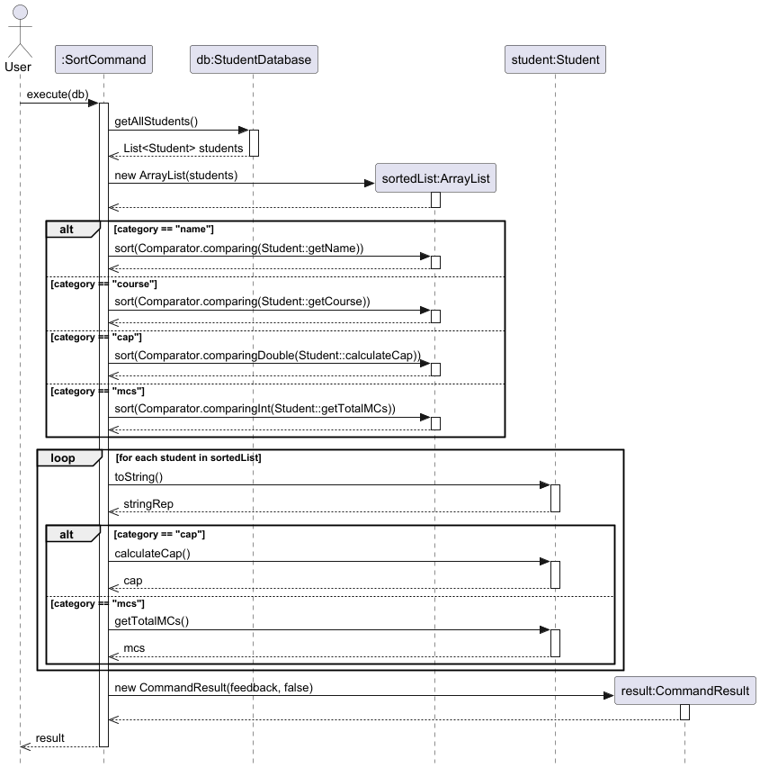

The sequence diagram illustrates the execution flow:
- User executes the sort command with a specified category (e.g., name, course, mcs)
- `Parser` class parses user input and determines the command (sort) and the category
- `SortCommand.execute()` is called with the `StudentDatabase` and `Storage`
- The command retrieves all student records from the `StudentDatabase`
- A `CommandResult` is returned containing the sorted list of students based on the specified category

##### Search Command

The `SearchCommand` allows users to search for students using certain categories, such as name, course, and mcs.

##### Class Diagram

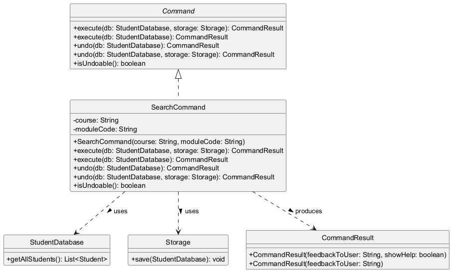

The class diagram shows the relationship between `SearchCommand` and other components:
- `SearchCommand` implements the `Command` interface
- `SearchCommand` needs to reference of `Storage` and `StudentDatabase`. 
- It interacts with `StudentDatabase` to retrieve relevant student records based on the specified search criteria
- Although `Storage` is not used in execute method under `SearchCommand`, the `Command` require it to be there. So the method signature must match `Command`.
- All methods listed in `Command` is implemented in `SearchCommand` class as there is no further child class from `SearchCommand`.
- Returns a `CommandResult` containing the search results based on the specified search criteria

##### Sequence Diagram

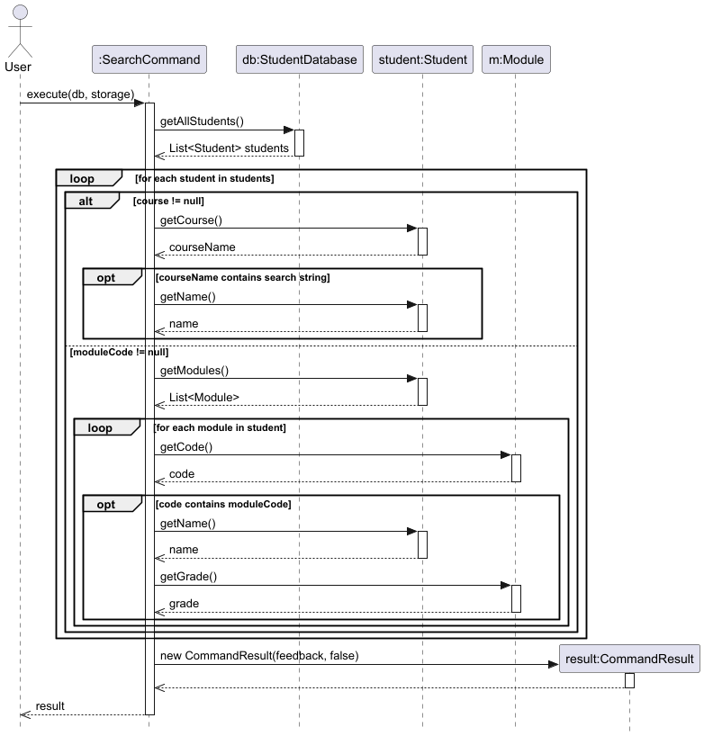

The sequence diagram illustrates the execution flow:
- User executes the search command with specified search criteria (e.g., name, course, mcs)
- `Parser` class parses user input and determines the command (search) and the search criteria
- `SearchCommand.execute()` is called with the `StudentDatabase` and `Storage`
- The command retrieves relevant student records from the `StudentDatabase` based on the specified search criteria
- A `CommandResult` is returned containing the search results based on the specified search criteria

---

### Implementation: Deny

#### Search Command with phone number

The `SearchCommand` allows users to search for students using certain categories, like their phone number.

##### Class Diagram

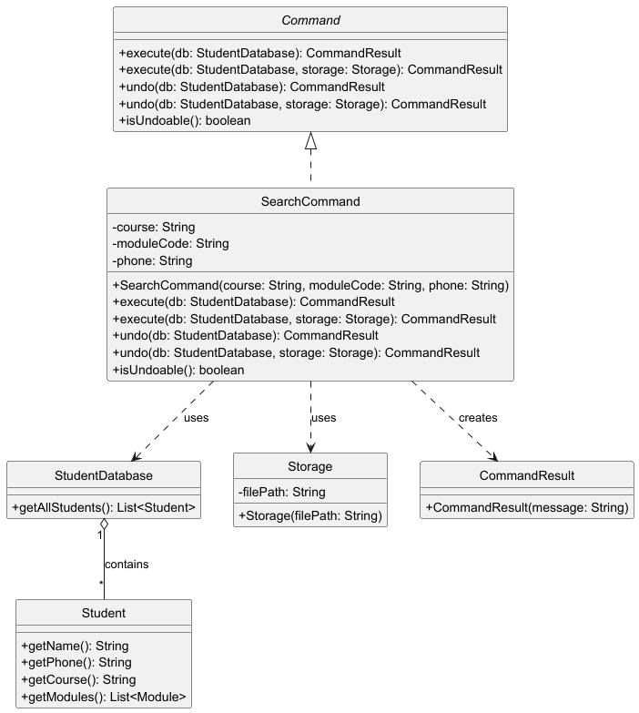

The class diagram shows the relationship between `SearchCommand` and other components:
- `SearchCommand` implements the `Command` interface
- `SearchCommand` references `Storage` and `StudentDatabase` as per the Command interface.
- It interacts with `StudentDatabase` to retrieve relevant student records based on the specified search criteria
- Although `Storage` is not used in execute method under `SearchCommand`, the `Command` interface requires it. 
Thus, the method signature of SearchCommand.execute() must match that of `Command`.
- All methods listed in `Command` is implemented in `SearchCommand` class
as there is no further child class from `SearchCommand`.
- Returns a `CommandResult` containing the search results based on the specified search criteria 
(i.e. possible substring of student phone number)

##### Sequence Diagram

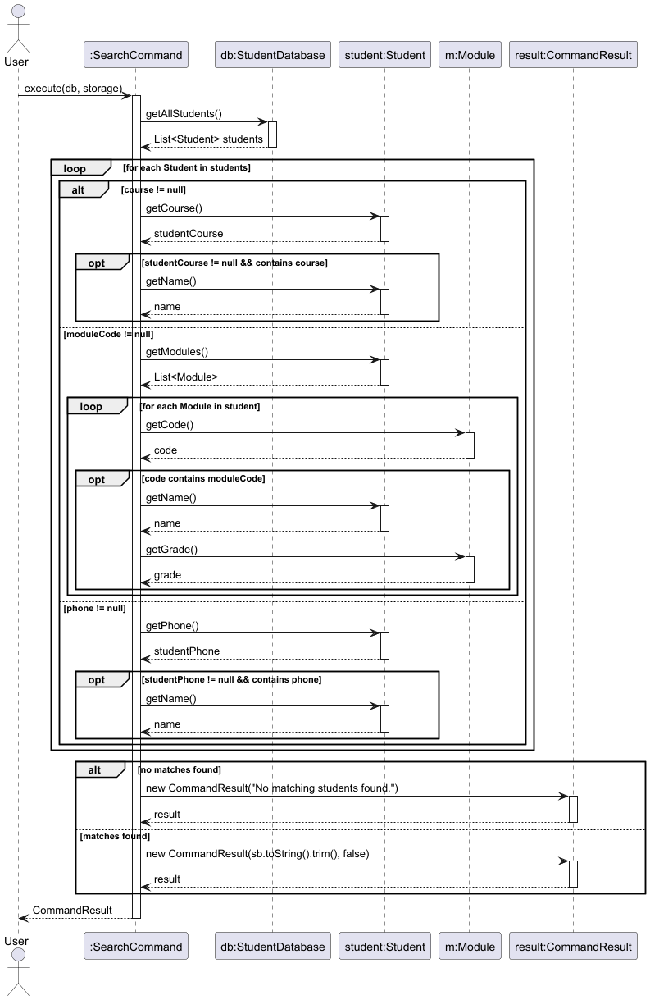

The sequence diagram illustrates the execution flow:
- User executes the search command with specified search criteria (in this case, students whose phone number contain 
the given substring)
- `Parser` class parses user input and determines the command (search) and the search criteria
- `SearchCommand.execute()` is called with the `StudentDatabase` and `Storage`
- The command retrieves relevant student records from the `StudentDatabase` based on the specified search criteria
- A `CommandResult` is returned containing the search results based on the specified search criteria

#### Storage

Storage manages saving changes to the StudentDatabase through the use of the DextroStudentList.txt file.
The StudentDatabase is saved whenever the list is altered in any way. If the program is run again, it will
automatically load the saved task in the txt file, extracting from text to a StudentDatabase.

##### Class Diagram

The class diagram shows the relationship between `Storage` and other components:
- `Storage` references `StudentDatabase` to retrieve relevant student records when saving the StudentDatabase 
in the txt file via toString(), dependent on the user command (if the StudentDatabase is altered).
- `Storage` interacts with `Student` to create each student parsed from the txt file.
- `Storage` also adds each module and grade associated with the created student previously saved in the txt file.

## Product scope
### Target user profile

The target user is an Administrative Staff member (Admin) at the National University of Singapore (NUS). These users are:
- Responsible for managing large cohorts of students and their academic progression
- Comfortable using Command Line Interfaces (CLI) for fast data entry and retrieval
- In need of a centralised, local system to manage student contact details and module grades without the overhead of a heavy web-based GUI.

### Value proposition

Student Records information may be stored in a fragmented fashion, with academic history in one system and progress tracking (GPA, Module Code) in another. The Student Record Data Management System (SRDMS) provides a streamlined, keyboard-centric workflow for maintaining student databases. By using a CLI-based approach, it enables admins to perform batch-like updates and quick searches significantly faster than traditional spreadsheet or form-based systems.

## User Stories

| Version | As a ... | I want to ...                            | So that I can ...                                                       |
|---------|----------|------------------------------------------|-------------------------------------------------------------------------|
| v1.0    | Admin    | create a new student record              | add new enrollees to the system record system.                          |
| v1.0    | Admin    | list all students                        | see a high-level overview of the current student population.            |
| v1.0    | Admin    | delete a student entry                   | remove records of students who have withdrawn or graduated.             |
| v2.0    | Admin    | edit student details (name, email, etc.) | ensure the database remains accurate as student information changes.    |
| v2.0    | Admin    | add or remove modules for a student      | track their academic history and specific module completions.           |
| v2.0    | Admin    | check the status of a student            | quickly see a student's CAP, total MCs, and overall academic standing.  |
| v2.0    | Admin    | search students by course or module      | filter the database to find specific groups for administrative actions. |

## Non-Functional Requirements

Non-functional requirements:
- Technical requirements: The program works on both 32- and 64-bit environments
- Usability: A new user may learn the commands in around 10 minutes of understanding the User Guide
- Reliability: If the program crashes, data up to before the latest command was given will be
saved in the DextroStudentList.txt file
- Portability: Program will work in Windows, macOS, and Linux environments
- Maintainability: Code follows quality standards taught and uses OOP design, with extracted classes
like Command and Object classes

## Glossary

* *glossary item* - Definition

## Instructions for manual testing

{Give instructions on how to do a manual product testing e.g., how to load sample data to be used for testing}
